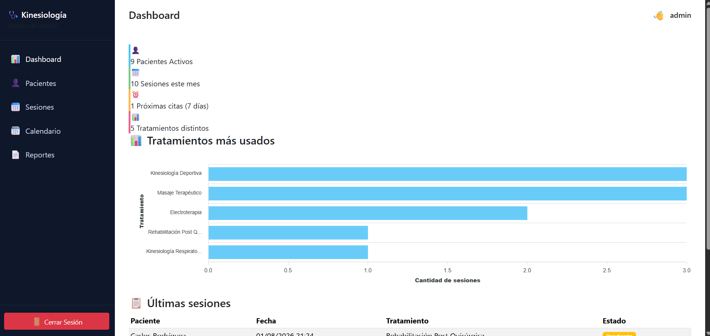
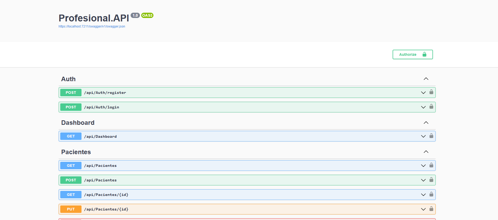
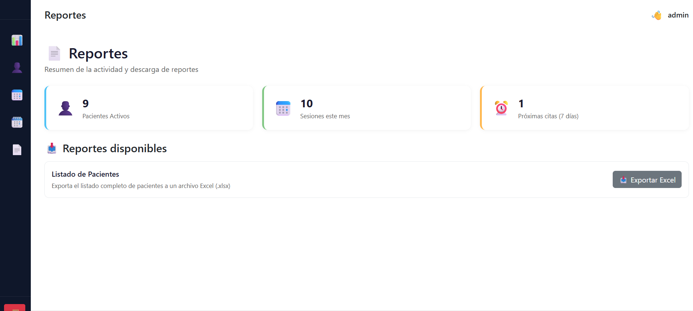
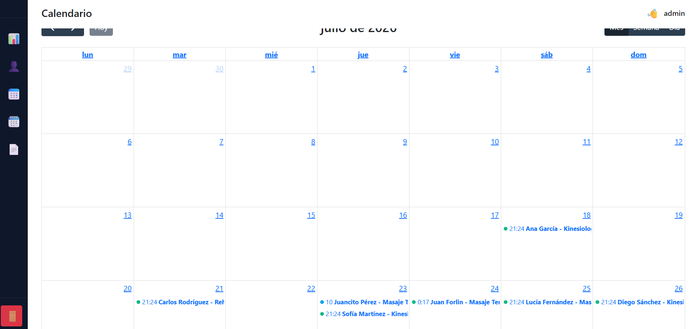

# Profesional.API

Sistema de gestión para profesionales de la salud (kinesiología) que permite administrar pacientes, sesiones/turnos y generar reportes. Compuesto por una API REST en .NET 8 (Clean Architecture) y un frontend en Blazor WebAssembly.

## Capturas de pantalla

| Dashboard | Reportes | Swagger (API) | Calendario |
|---|---|---|---|
|  |  |  |

## Características

- Autenticación de usuarios con JWT (registro y login)
- ABM de pacientes (alta, listado, detalle, edición)
- Gestión de sesiones/turnos por paciente, con estado (completada/pendiente) y próxima cita
- Dashboard con métricas: pacientes activos, sesiones del mes, próximas citas y tratamientos más usados
- Módulo de reportes con exportación a Excel (pacientes)
- Calendario de turnos

## Stack técnico

**Backend**
- .NET 8 / ASP.NET Core Web API
- Entity Framework Core 8 (SQL Server)
- Autenticación JWT (`Microsoft.AspNetCore.Authentication.JwtBearer`)
- BCrypt.Net para hash de contraseñas
- EPPlus para exportación a Excel
- Swagger / Swashbuckle para documentación de la API

**Frontend**
- Blazor WebAssembly (.NET 7)
- Blazor-ApexCharts para gráficos

**Testing**
- xUnit, Moq, FluentAssertions

## Arquitectura

El backend sigue Clean Architecture, separado en capas:

```
Profesional/
├── src/
│   ├── Profesional.API             # Controllers, middlewares, configuración (capa de presentación)
│   ├── Profesional.Application     # DTOs, servicios, interfaces (lógica de aplicación)
│   ├── Profesional.Domain          # Entidades del dominio (Paciente, Sesion, Usuario)
│   └── Profesional.Infrastructure  # DbContext, migraciones de EF Core
├── tests/
│   └── Profesional.UnitTests       # Tests unitarios (xUnit)
└── Profesional.Frontend/           # Cliente Blazor WebAssembly
```

## Endpoints principales

| Método | Ruta | Descripción |
|---|---|---|
| POST | `/api/Auth/register` | Registro de usuario |
| POST | `/api/Auth/login` | Login (devuelve JWT) |
| GET | `/api/Dashboard` | Métricas del dashboard |
| GET | `/api/Pacientes` | Listado de pacientes |
| POST | `/api/Pacientes` | Crear paciente |
| GET | `/api/Pacientes/{id}` | Detalle de paciente |
| PUT | `/api/Pacientes/{id}` | Editar paciente |
| GET | `/api/Sesiones` | Listado de sesiones |
| GET | `/api/Sesiones/paciente/{pacienteId}` | Sesiones de un paciente |
| POST | `/api/Sesiones` | Crear sesión |
| PUT | `/api/Sesiones/{id}` | Editar sesión |
| PATCH | `/api/Sesiones/{id}/completar` | Marcar sesión como completada |
| GET | `/api/Reportes/pacientes` | Exportar listado de pacientes a Excel |

La documentación interactiva completa está disponible en Swagger (`/swagger`) una vez levantada la API.

## Requisitos previos

- [.NET 8 SDK](https://dotnet.microsoft.com/download) (y .NET 7 SDK para el frontend Blazor)
- SQL Server (LocalDB, Express o full)

## Puesta en marcha

1. Cloná el repositorio:

   ```bash
   git clone https://github.com/<tu-usuario>/Profesional.API.git
   cd Profesional.API/Profesional
   ```

2. Configurá la cadena de conexión en `src/Profesional.API/appsettings.json` (o mediante `appsettings.Development.json` / user-secrets):

   ```json
   "ConnectionStrings": {
     "ApplicationDbContext": "Server=.\\SQLEXPRESS01; Initial Catalog=ProfesionalDB; Integrated Security=true; TrustServerCertificate=true;"
   }
   ```

3. Aplicá las migraciones de base de datos:

   ```bash
   cd src/Profesional.API
   dotnet ef database update
   ```

4. Ejecutá la API:

   ```bash
   dotnet run --project src/Profesional.API
   ```

   La API queda disponible en `https://localhost:7211` (Swagger en `https://localhost:7211/swagger`).

5. Ejecutá el frontend (en otra terminal):

   ```bash
   dotnet run --project Profesional.Frontend
   ```

   El frontend queda disponible en `https://localhost:7163`.

## Tests

```bash
dotnet test Profesional/tests/Profesional.UnitTests
```

## Configuración de JWT

La clave, issuer y audience del token se configuran en `appsettings.json`:

```json
"Jwt": {
  "Key": "clave-secreta-de-al-menos-32-caracteres",
  "Issuer": "ProfesionalAPI",
  "Audience": "ProfesionalClient"
}
```

> Para producción, reemplazar la clave por un secreto seguro (variables de entorno o un vault), nunca commitear valores reales.

## Licencia

Sin licencia definida aún.
